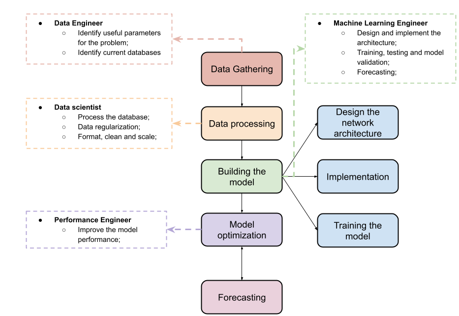

ML-pipeline
###########

ML-pipeline are the common tasks necessary to train models using machine learning, and its summarized in figure bellow. 

The ML-pipeline usually includes data processing aspects and sometimes also the deployment of the final model, but here ML-pipeline deals with building the model to forecasting. We reserved one chapter exclusively for data processing due to its importance in COVID-19 forecasting.

Methods
*******

That are many methods of machine learning to find models to forecast time-series. These methods can be categorized in three simple categories: Baseline, Autoregression, Epidemiological and Machine Learning. Here the Machine Learning category encompass: Linear Machine learning, Nonlinear machine learning, ensemble machine learning, deep learning and many more variants.

.. csv-table:: Methods for time-series forecasting
   :file: tables/methods.csv
   :widths: 30, 30, 30, 30
   :header-rows: 1

Training
********

These methods get some data as input and tune its parameters to reduce the error of the expected output and the model output. This is the training part. All methods produce a similar result, i.e, a model that can be used to make predictions about future outcomes.

Evaluation
**********

Metrics

Ensemble
********

Combine forecasts from many methods to improve forecast performance.