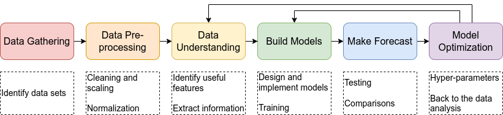

What is Machine Learning?
###########

 "Machine Learning is the science (and art) of programming computers so they can learn from data."

 ``(Hands-on Machine Learning with Scikit-Learn, Keras, and TensorFlow - Aurélien Géron, 2019)``

There are two viewpoint regarding how to define machine learning:

- The user's viewpoint

- The expert's viewpoint

The user's viewpoint is concerned with the application of a method to improve data-driven decision making. Expert's viewpoint are concerned with a wide range of data analysis methods, models, and algorithms. For the second viewpoint, the emphasis is on data, which defines the quality of the results and the algorithm choices. In general, fot both viewpoints the goal of machine learning is to assist in making data-driven decisions.

Given this, machine learning is concerned with making predictions using black-box models based on identifying patterns in data.

The machine learning pipeline is divided into four steps:

**1- Data comprehension:** what information is there? To answer it, we must create additional multiple-choice questions;

**2- Forecasting:** predict or regress what will happen in the future or categorize the data;

**3- Taking a decision:** what should be done based on the predictions made in the previous step? What are the possible decisions based on the predictions?

**4- Draw causal inferences:** determine what works and what does not work in terms of the decisions made.

Ncovid-ml pipeline
*******

The Ncovid-ml supports the common tasks needed to collect data, prepare it, and train/test them with mathematical models (such as epidemiological, neural networks, and auto - regressive) on regression tasks, summarized in the figure bellow.

The system permits the user to explore the online and offline system functionalities. For the offline approach, each step presented above in the figure are proposed `jupyter-notebooks <https://github.com/Natalnet/ncovid-ml-modules/tree/main/jupyter-notebook>`_ as examples.

Methods
*******

Data Gathering
==================

A data constructor is able to collect data online or offline (data in local path) and load into a pandas format.

Training
********

These methods get some data as input and tune its parameters to reduce the error of the expected output and the model output. This is the training part. All methods produce a similar result, i.e, a model that can be used to make predictions about future outcomes.

Evaluation
**********

Metrics

Ensemble
********

Combine forecasts from many methods to improve forecast performance.
